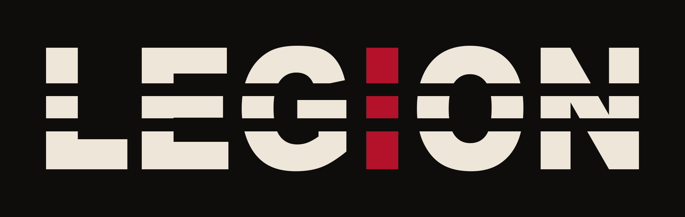
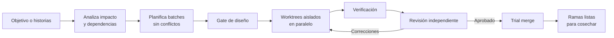

<p align="center">
  
</p>

<p align="center"><a href="README.md">English</a> · <strong>Español</strong></p>

# Convertí un backlog en entregas paralelas, aisladas y revisadas

 **EGION** transforma un backlog en implementaciones aisladas y revisadas. Decide qué historias pueden avanzar juntas, le da a cada una su propio Git worktree y pone un revisor independiente entre el código generado y la entrega.

Traé un objetivo o cualquier cantidad de historias. Legion se ocupa de la coordinación:

- **Paralelismo seguro:** las historias independientes avanzan juntas; las que se superponen se serializan automáticamente.
- **Aislamiento por defecto:** cada historia recibe su propia rama y worktree desde un único clone base.
- **Revisión antes y después del código:** aprobación opcional del diseño, verificaciones y revisión adversaria en cada entrega.
- **Conoce el proyecto, no depende del stack:** aprende una vez los comandos, convenciones, migraciones y configuración local del repositorio.
- **Se puede reanudar:** planes, decisiones, progreso y revisiones quedan en disco si la sesión se interrumpe.



**Vos describís el resultado. Legion administra la cola, el aislamiento, los gates de diseño, los especialistas, la verificación y la revisión. Vos conservás el control de commits, pushes y PRs.**

## Inicio rápido

### 1. Agregá tu proyecto

Cloná uno o más repositorios destino dentro de [`workspace/`](workspace/) y registrá cada uno:

```text
workspace/
├── proyecto-a/
└── proyecto-b/
```

No necesitás preparar N clones ni ramas. Legion crea worktrees cuando hacen falta. Se recomienda partir de una base commiteada porque los worktrees nacen del commit de la rama base; si hay cambios locales que podrían quedar afuera, Legion avisa antes de continuar.

### 2. Describí el trabajo

Empezá desde lo que ya tengas:

```text
/new-objective Reducir un 30% el tiempo de checkout
/new-story SHOP-142: Permitir reintentar un pago fallido
```

`/new-objective` divide un resultado de negocio en historias entregables de forma independiente. `/new-story` contrasta un pedido puntual con el código real, detecta decisiones faltantes y escribe el resultado confirmado en [`requirements/<project>.md`](requirements/<project>.md).

¿Ya tenés backlog? Pegá las historias directamente en ese archivo usando bloques `# Story <ID>` separados por `---`.

### 3. Previsualizá o ejecutá

```text
/legion dry-run
/legion
```

Usá `dry-run` cuando el alcance sea grande, ambiguo o transversal. Legion guarda diseños revisables en `.orchestrator/projects/<project>/designs/` antes de implementar. Ejecutá `/legion` directamente cuando las historias ya estén bien definidas.

Al registrar un proyecto, Legion pregunta los campos de catálogo que no puede inferir, como rama base, prefijo y concurrencia. La verificación y las migraciones se derivan del repo real y se revalidan al usarlas.

### 4. Cosechá el trabajo revisado

Cada historia aprobada queda sin commitear en su propia carpeta:

```bash
cd workspace/worktrees/<project>--<Story-ID>
git status
# revisá, commiteá, pusheá y abrí un PR cuando estés conforme
```

Legion no commitea, pushea ni crea PRs. No borres un worktree antes de commitear o guardar sus cambios de otra manera.

## Qué resuelve una ejecución

1. **Valida el workspace** y actualiza su visión de la rama base remota.
2. **Mapea impacto y dependencias** y muestra una vista de batches; cada reserva se revalida individualmente.
3. **Elige el agente adecuado:** generalista o especialista en frontend, seguridad, datos o documentación.
4. **Crea un worktree por historia activa** y mantiene a cada agente dentro de su alcance.
5. **Evalúa el diseño** antes de escribir código; `dry-run` permite revisarlo y corregirlo primero.
6. **Implementa y verifica** con los comandos y convenciones reales del proyecto destino.
7. **Ejecuta una revisión adversaria independiente;** lo rechazado vuelve a corrección, hasta tres rondas antes de escalar.
8. **Rota la cola** cuando se libera capacidad, respetando conflictos de código y dependencias explícitas.
9. **Comprueba el resultado combinado** con controles de consistencia y un trial merge antes de cerrar.

Cada proyecto tiene su propio techo `max_parallel`. Los claims se cuentan bajo el mutex breve del proyecto, por lo que dos sesiones no pueden tomar a la vez el último lugar disponible. La cantidad de historias en cola no tiene límite.

## Elegí el comando correcto

| Tenés… | Usá | Resultado |
|---|---|---|
| Un objetivo de negocio, no un backlog | `/new-objective` | Una división confirmada en historias concretas |
| Un pedido de funcionalidad poco definido | `/new-story` | Una historia validada contra el código y lista para implementar |
| Historias listas para implementar | `/legion` | Implementación paralela y revisión |
| Historias riesgosas o ambiguas | `/legion dry-run` | Diseños revisables antes de escribir código |
| Una pregunta técnica | `/investigate` | Un hallazgo de investigación de solo lectura |
| Una lección de producción que conviene retener | `/new-lesson` | Guía persistente para futuros cambios en esa zona |
| Una capacidad externa para Legion | `/new-module <repo-o-ruta>` | Un módulo instalado después de revisar permisos y riesgos |
| Un módulo generador ya instalado | `/run-module <nombre>` | Un artefacto regenerable fuera del ciclo de historias |
| Un checkout de Legion anterior al soporte multiproyecto | `/legion-upgrade` | Una migración guiada que conserva el trabajo existente |

Para migrar un checkout anterior, ejecutá `/legion-upgrade`. Detecta el layout legacy en disco, o lo recupera automáticamente si un pull de Git ya lo reemplazó, y previsualiza la migración al layout multiproyecto sin borrar originales. Iniciá una nueva sesión de Claude Code solo si la actual es anterior a este comando; los conflictos de Git siguen siendo tuyos para resolver.

Los comandos aceptan argumentos opcionales; si los invocás solos, los asistentes te guían. La prosa persistida sigue el idioma establecido por el repo destino; los tags estructurales permanecen en inglés.

## Escribir historias manualmente

Solo son obligatorios el encabezado y el contenido de la historia:

```md
# Story SHOP-142

Como cliente, quiero reintentar un pago fallido para poder completar mi compra.

Criterios de aceptación:
- Un pago fallido se puede reintentar sin duplicar la orden.
- El cliente ve el estado final del pago.

## Depends on (opcional)
SHOP-120

## Subtasks (opcional)
1. [backend] Agregar la operación de reintento
2. [security] Revisar su autorización (depends on 1)

---
```

`## Depends on` expresa una dependencia de negocio. No hace falta declarar la superposición de código: Legion la detecta y separa esas historias. Usá `## Subtasks` solo cuando un dominio necesite su propia ejecución y gate de aprobación.

## Seguir el progreso sin leer todo

Empezá por estos tres artefactos:

| Necesidad | Abrí |
|---|---|
| Historia, rama, batch, estado y ronda de revisión actuales | [`.orchestrator/projects/<project>/assignments.md`](.orchestrator/projects/<project>/assignments.md) |
| Diseño aprobado o pendiente de una historia | `.orchestrator/projects/<project>/designs/<Story-ID>.md` |
| Informe de revisión independiente | `.orchestrator/projects/<project>/reviews/<Story-ID>-code-review-Rn.md` |

El resto es memoria durable del sistema: eventos, decisiones, componentes reutilizables, señales, lecciones aprendidas, métricas y reputación de agentes. Consultá [`.orchestrator/README.md`](.orchestrator/README.md) solo cuando necesites la referencia completa de artefactos.

Si la sesión se interrumpe, ejecutá `/legion` otra vez. Reconstruye la ejecución desde los Git worktrees y el tablero persistido, y retoma lo incompleto sin empezar de cero.

## Extender Legion con módulos

Los módulos agregan capacidades autocontenidas sin modificar el núcleo de Legion. Un módulo puede validar una historia (`gate`), generar un artefacto bajo demanda (`generator`) o implementar una subtask asignada explícitamente (`implementer`). Legion valida el manifiesto y muestra sus permisos y riesgos antes de instalarlo.

```text
/new-module https://github.com/luk-s12/legion-modules
```

Consultá [`modules/README.md`](modules/README.md) para conocer el ciclo de vida y [Legion Modules](https://github.com/luk-s12/legion-modules) para ver los módulos disponibles.

## Garantías operativas

- El orquestador coordina; no edita los worktrees de las historias.
- Cada implementador escribe solo en su worktree asignado. Los especialistas de documentación y datos tienen excepciones de salida acotadas y documentadas.
- Ninguna historia se cierra sin una revisión independiente con resultado `APPROVED`.
- Los comandos y supuestos específicos del proyecto deben provenir del repositorio o de `.orchestrator/projects.yml`.
- Legion nunca commitea, pushea, crea PRs ni amplía silenciosamente los permisos declarados por un módulo.
- Los manifiestos vuelven auditables las capacidades, pero no reemplazan un sandbox del sistema operativo; el acceso a comandos tiene el alcance del proceso host.

El protocolo completo de orquestación está en [`CLAUDE.md`](CLAUDE.md). Las reglas de seguridad y ciclo de vida de módulos están en [`modules/README.md`](modules/README.md).

## Mapa del repositorio

```text
legion/
├── requirements/<project>.md             # objetivos e historias
├── workspace/
│   ├── <repo_dir>/                       # un clone por proyecto registrado
│   └── worktrees/<project>--<Story-ID>/  # entrega aislada por historia
├── .claude/
│   ├── agents/                           # implementadores, especialistas y revisores
│   └── skills/                           # comandos y guías reutilizables
├── .orchestrator/
│   ├── projects.yml                      # catálogo de proyectos, única autoridad de configuración
│   └── projects/<project>/               # memoria, diseños, revisiones y estado por proyecto
├── modules/                              # módulos instalados, registro, reportes y salidas
├── docs/<project>/                       # documentación generada, cuando se solicita
└── scripts/<project>/                    # scripts auxiliares de datos, cuando se solicitan
```

## Licencia

Consultá [`LICENSE.md`](LICENSE.md). En resumen: se permite el uso interno y personal; redistribuir, revender, crear productos derivados o incorporar Legion en otro software requiere autorización. Las reseñas, demostraciones con enlace a la fuente oficial y forks para contribuir están permitidos explícitamente.
