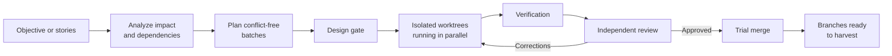

<p align="center">
  
</p>

<p align="center"><strong>English</strong> · <a href="README.es.md">Español</a></p>

# Turn a backlog into parallel, isolated, reviewed deliveries

 **EGION** turns a backlog into isolated, reviewed implementations. It plans which stories can run together, gives each one its own Git worktree, and keeps an independent reviewer between generated code and delivery.

Bring an objective or any number of user stories. Legion handles the coordination:

- **Parallel when safe:** independent stories run together; overlapping work is serialized automatically.
- **Isolated by default:** every story gets its own branch and worktree from one base clone.
- **Review before and after code:** optional design approval, automated checks, and adversarial review on every delivery.
- **Project-aware, not stack-bound:** Legion learns the repository's commands, conventions, migrations, and local setup once.
- **Recoverable:** plans, decisions, progress, and reviews live on disk, so an interrupted run can resume.



**You describe the outcome. Legion manages the queue, isolation, design gates, specialists, verification, and review. You keep control of commits, pushes, and PRs.**

## Quick start

### 1. Add your project

Clone one or more destination repositories inside [`workspace/`](workspace/) and register each one:

```text
workspace/
├── project-a/
└── project-b/
```

You do not need to prepare N clones or branches. Legion creates worktrees on demand. A committed baseline is recommended because worktrees start from the base branch's commit; if local changes could be left behind, Legion warns before proceeding.

### 2. Describe the work

Start from whichever input you already have:

```text
/new-objective Reduce checkout time by 30%
/new-story SHOP-142: Let customers retry a failed payment
```

`/new-objective` breaks a business goal into independently deliverable stories. `/new-story` checks one request against the real code, surfaces missing decisions, and writes the confirmed result to [`requirements/<project>.md`](requirements/<project>.md).

Already have a backlog? Paste stories directly into that file using `# Story <ID>` blocks separated by `---`.

### 3. Preview or run

```text
/legion dry-run
/legion
```

Use `dry-run` when scope is large, ambiguous, or cross-cutting. Legion persists reviewable designs in `.orchestrator/projects/<project>/designs/` before implementation. Run `/legion` directly when the stories are already well specified.

On registration, Legion inspects the project and asks for the catalog fields it cannot infer, such as base branch, branch prefix and concurrency. Verification and migration facts come from the real repo and are revalidated when used.

### 4. Harvest reviewed work

Each approved story remains uncommitted in its own folder:

```bash
cd workspace/worktrees/<project>/<Story-ID>
git status
# inspect, commit, push, and open a PR when satisfied
```

Legion does not commit, push, or create PRs. Do not remove a worktree before committing or otherwise saving its changes.

## What a run does for you

1. **Validates the workspace** and updates its view of the remote base branch.
2. **Maps impact and dependencies** and shows a batch planning view; every reservation is revalidated individually.
3. **Selects the right agent**—generalist or a focused frontend, security, data, or docs specialist.
4. **Creates one worktree per active story** and keeps each agent inside its assigned scope.
5. **Gates the design** before code is written; `dry-run` lets you inspect and amend it first.
6. **Implements and verifies** using the destination project's real commands and conventions.
7. **Runs an independent adversarial review**; rejected work returns for correction, up to three rounds before escalation.
8. **Rotates the queue** as capacity becomes available, honoring code conflicts and explicit dependencies.
9. **Checks the combined result** with final consistency checks and a trial merge before closing.

Each project has its own `max_parallel` ceiling. Story claims are counted while holding that project's brief mutex, so multiple Claude sessions cannot both take the last capacity place. The number of queued stories is not limited.

## Choose the right command

| You have… | Use | Result |
|---|---|---|
| A business outcome, not a backlog | `/new-objective` | A confirmed split into concrete stories |
| One rough feature request | `/new-story` | A code-validated, implementation-ready story |
| Stories ready to implement | `/legion` | Parallel implementation and review |
| Risky or ambiguous stories | `/legion dry-run` | Reviewable designs before any code is written |
| A technical question | `/investigate` | A read-only research finding |
| A production lesson worth retaining | `/new-lesson` | Persistent guidance for future work in that code area |
| An external Legion capability | `/new-module <repo-or-path>` | An installed module after permission and risk review |
| An installed generator module | `/run-module <name>` | A regenerable artifact outside the story cycle |
| A Legion checkout from before multiproject support | `/legion-upgrade` | A guided migration that preserves existing work |

To migrate an older checkout, run `/legion-upgrade`. It finds the legacy layout on disk, or recovers it automatically if a Git pull already replaced it, then previews the migration to the multiproject layout without deleting originals. Start a new Claude Code session first only if your current one predates this command; Git conflicts remain yours to resolve.

Commands accept optional inline arguments; invoked bare, the assistants guide you interactively. Conversation follows your language. Persisted prose follows the destination repo's established language; structural tags remain in English.

## Write stories manually

Only the header and story content are required:

```md
# Story SHOP-142

As a customer, I want to retry a failed payment so I can complete my order.

Acceptance criteria:
- A failed payment can be retried without duplicating the order.
- The customer sees the final payment state.

## Depends on (optional)
SHOP-120

## Subtasks (optional)
1. [backend] Add the retry operation
2. [security] Review retry authorization (depends on 1)

---
```

`## Depends on` expresses a business dependency. Code overlap does not need to be declared: Legion discovers it and schedules those stories separately. Use `## Subtasks` only when a domain needs its own execution and approval gate.

## Follow progress without reading everything

Start with these three artifacts:

| Need | Open |
|---|---|
| Current story, branch, batch, status, and review round | [`.orchestrator/projects/<project>/assignments.md`](.orchestrator/projects/<project>/assignments.md) |
| A story's approved or pending design | `.orchestrator/projects/<project>/designs/<Story-ID>.md` |
| An independent review report | `.orchestrator/projects/<project>/reviews/<Story-ID>-code-review-Rn.md` |

The rest is durable system memory: events, decisions, reusable components, signals, lessons learned, metrics, and agent reputation. See [`.orchestrator/README.md`](.orchestrator/README.md) only when you need the complete artifact reference.

If a session is interrupted, run `/legion` again. It reconstructs the run from Git worktrees and the persisted board, then resumes incomplete work instead of starting over.

## Extend Legion with modules

Modules add self-contained capabilities without changing Legion's core. A module can verify a story (`gate`), generate an artifact on demand (`generator`), or implement an explicitly assigned subtask (`implementer`). Legion validates its manifest and shows its permissions and risks before installation.

```text
/new-module https://github.com/luk-s12/legion-modules
```

See [`modules/README.md`](modules/README.md) for lifecycle details and [Legion Modules](https://github.com/luk-s12/legion-modules) for available modules.

## Operating guarantees

- The orchestrator coordinates; it does not edit story worktrees.
- An implementing agent writes only in its assigned worktree. Document and data specialists have narrowly documented output exceptions.
- No story closes without an independent `APPROVED` review.
- Project-specific commands and assumptions must come from the repository or `.orchestrator/projects.yml`.
- Legion never silently commits, pushes, opens a PR, or broadens a module's declared permissions.
- Module manifests make capabilities auditable but do not replace an operating-system sandbox; command access has the reach of the host process.

For the complete orchestration protocol, see [`CLAUDE.md`](CLAUDE.md). For module security and lifecycle rules, see [`modules/README.md`](modules/README.md).

## Repository map

```text
legion/
├── requirements/
│   └── <project>.md                      # objectives and stories
├── workspace/
│   ├── <repo_dir>/                       # one clone per registered project
│   └── worktrees/
│       └── <project>/                    # one directory per project
│           └── <Story-ID>/               # isolated delivery per story
├── .claude/
│   ├── agents/                           # implementers, specialists, and reviewers
│   └── skills/                           # user commands and reusable guidance
├── .orchestrator/
│   ├── projects.yml                      # project catalog, the sole configuration authority
│   └── projects/                         # one <project>/ per registered project (+ .gitkeep)
│       └── <project>/                    # per-project memory, materialized on registration
│           ├── assignments.md            # derived scheduling board
│           ├── components.md             # reusable component registry
│           ├── lessons-learned.md        # permanent business-rule incidents
│           ├── metrics.md                # derived duration / token history
│           ├── reputation.md             # derived review audit
│           ├── announcements/            # horizontal research findings
│           ├── decisions/                # DEC-NNN architectural decisions
│           ├── designs/                  # <Story-ID>.md approved designs
│           ├── events/                   # <Story-ID>.md append-only progress
│           ├── module-rules/             # per-project accepted module rules
│           ├── objectives/               # /new-objective breakdown memory
│           ├── reviews/                  # <Story-ID>-*.md review reports
│           ├── signals/                  # horizontal signals
│           └── stories/                  # /new-story working drafts
├── modules/                              # installed modules, registry, reports, outputs
├── docs/
│   └── <project>/                        # generated documentation, when requested
└── scripts/
    └── <project>/                        # auxiliary data scripts, when requested
```

The `<project>/` memory tree has no on-disk template: it is materialized from the skeleton in
[`.orchestrator/README.md`](.orchestrator/README.md) when a project is registered, or when
`/legion-upgrade` migrates an older single-project checkout into the multiproject layout.

## License

See [`LICENSE.md`](LICENSE.md). In short: internal and personal use are allowed; redistribution, resale, derivative products, or embedding Legion in other software require authorization. Reviews, demonstrations linking to the official source, and contribution forks are explicitly allowed.
